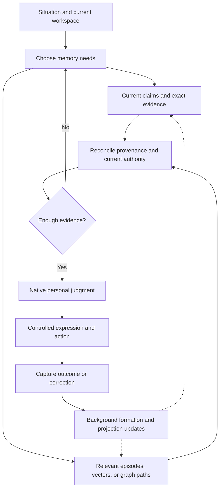

# FloRA latency architecture recalibration

## Current: narrow owned judgment composition — October 3

The owner approved continuing FloRA within its prototype scope. [The minimal invocation contract](MINIMAL_JUDGMENT_INVOCATION_2026-10-03.md) maps current state/evidence, H/C rights, external judgment, explicit recovery and linked outcome/successor boundaries. The first composition slice reuses the invocation's actual prepared context for delivery, removing a second context assembly. Exact cited originals are still read/authenticated; live rights and owner proofs are not cached. The original runtime policy owner remains current across callbacks.

[The construction receipt](evidence/2026-10-03_minimal_judgment_composition.json) preserves three RED results, **27/27 final Linux runtime/domain checks**, and the fresh review's two corrected regressions. Standalone supplied-context delivery still reconstructs; external producer and independent recovery semantics remain. The mixed broader local check was stopped after its loaded serving source became obsolete; it is incomplete. Ordinary selected-engine verification is pending publication. No latency, learned or release qualification follows.

Full-H reconstruction inside phase predicates and passive result recovery remain unchanged. This foreground composition does not by itself fix the sampled native recovery latency. Continue from actual physical results and the named boundary contract; do not select another hotspot patch or build the full Alice platform. Personality and MFM remain external. The FBM corpus now has **124 validated procedure traces**, with this construction/failure/review lesson in record124. Prior reset and failure snapshots below remain historical.

## Owner reset — 2026-10-03; controls the next continuation

The owner stopped the unprofitable trial-and-error sequence. Further local proof
tuning, row-batching patches and diagnostic extensions are suspended as the
default next work. No serving change or new job was made in this reset.

The process drift is concrete: the October 1 decision below already required an
architectural change and an explicit lookup/integrity/authorization protocol.
Later continuation returned to helper repairs and increasingly detailed probes.
Those probes answered local questions, but did not establish the correct narrow
request path or advance a demonstrated native causal judgment. They cannot become
an indefinite prerequisite program. The next step is the boundary design already
called for here, not the next easiest hotspot.

### What the last completed run establishes

[Scoped run 37141011069](https://github.com/NIne-WIngEd/FloRA/actions/runs/37141011069)
collected successfully; **the fixture failed** and qualification remains false.
[Exact validation](evidence/2026-10-03_78041807_native_stack_scopes_validation.json)
verifies the actual archive and all 117 after/116 before FloRA/Alice source blobs.
The [artifact](evidence/2026-10-03_78041807_native_stack_scopes.json) has 2,237
owned samples. Its scope matrix sums exactly to that total. The sampler stopped,
with zero observer errors, truncations, discarded samples or capped coverage.

| Nearest fixed scope | Samples |
| --- | ---: |
| Current-history metadata | 989 |
| Initial context barrier | 636 |
| Shared context-frame initialization | 315 |
| Actual context assembly | 260 |
| Other context preparation | 31 |
| Initial full-history authentication | 4 |
| Unscoped owned work | 2 |

Current-history metadata includes 472 deepest SQL-execute, 260 registry-fetch and
75 Kurrent-read samples. Registry-fetch includes untargeted descendants. These
are approximate wall samples, not CPU/call counts or predicted savings. They
support inspecting the repeated current-H path; they do not qualify the proposed
local batching patch. The [review](evidence/2026-10-03_78041807_native_stack_scopes_review.json)
preserves that limit and the owner's override.

### Concrete scope reset

FloRA's required behavior remains: correction/outcome changes a relevant later
native judgment for the right reason; unrelated judgments stay stable; comparator,
same-evidence ablation and held-out attribution remain credible. Qualified
personality and MFM outputs come from their existing external workstreams.

| Responsibility | Necessary FloRA slice | Boundary for the redesign |
| --- | --- | --- |
| Experience and originals | Scoped original/correction/outcome IDs, exact evidence locators, durable provenance | Record evidence and outcomes; full replay/authentication/recovery are explicit operations. |
| Claims and personal state | Accepted versioned state, evidence relationships, current heads, correction/supersession | Serve current materialized state and selected dependencies; MFM proposals still require deterministic authority. |
| Context and native invocation | A finite selected plan, authorized actual evidence, consumed-source attribution, qualified external producer | Define one owned invocation protocol with named protected accesses and fresh authority observations. |
| Experiment governance | Exact BEFORE/AFTER history, full-H evaluation rights, manifests, separate C judgment rights/caps, fair arms | Map H evaluation admission and C data use explicitly; do not rebuild the full-H protocol implicitly inside each low-level predicate. |
| Outcome feedback | Decision-to-result/correction-to-evidence-to-state lineage | Test the causal link; add mission/node IDs only if the case needs them. No full mission scheduler is required. |

This is not permission to omit H consent, source integrity, current withdrawals,
AFTER exclusion, independent producer/recovery attribution or the terminal fence.
The boundary specification must state each live fact, its observer, protected
access and rejection point. If a check moves, show where its obligation remains
enforced before private use and before result acceptance. No positive permission
or qualification answer carries across protected boundaries. Keep the selected
physical adapters for surfaces actually exercised; add no replacement database.

Alice's original Memory Architecture v4.1 §3.2 says ordinary serving uses current
materialization and historical reconstruction stays explicit and bounded. Its
Performance Standard §§4–7 prefers bounded selected plans, hydration and freshness.
The reviewed comic connects prior relevant lessons to later decisions. These
requirements describe the causal entity's interactions; they do not require the
prototype to finish every Alice plane. Original pins remain in the source map
and audit below; existing Graphify/Graphiti research remains applicable by role.

### Next engineering deliverable

Specify the selected native invocation protocol against the actual code:
experiment entry → current selected Claim/state and evidence → qualified external
personal judgment → independently attributed result → correction/outcome update.
For every transition, name required H/C rights, exact immutable dependencies,
live heads, callbacks, private reads and final observations. Then replace the
responsible composition as one scoped design change and verify the affected
correctness/race cases plus a complete selected-engine BEFORE/AFTER invocation.

Do not launch more diagnostic jobs by default. A further probe needs a concrete
remaining design question that existing source/evidence cannot settle. Do not
repeat the unchanged full component suite merely to obtain another receipt.
Construction, ordinary response and passive recovery must be reported as their
actual scopes; the 10,000/60,000 ms response and 60-minute CI limits and old failed
results stay unchanged. No new timing definition retroactively passes a failure.

The process reset and latest source recovery are captured in FBM record 123.
Earlier notices below are historical. Runtime remains `4b88946f`; no learned,
latency or release qualification is claimed.

Date: 2026-10-01 UTC
Status: source-grounded direction; implementation and performance qualification pending

## Decision

Pause further loop-level latency tuning. The next work is architectural: selective retrieval, incremental evidence lookup, current projections, and explicit authority boundaries.

The prior profiler localized real repeated work. It did not establish that another codec shortcut was the right solution. The measured native case is experiment custody/recovery machinery, not a companion conversation.

The selected physical stack remains XTDB, Kurrent, Qdrant, Ladybug, NATS, and Temporal. Personality and MFM remain separate workstreams. This review adds no substitute model.

## Review coverage and authority

- Inventoried all 80 A.L.I.C.E. branches, with 78 distinct heads. The second branch page was empty. The architecture audit inspected all recursive trees; none was truncated.
- Read the relevant current architecture, performance, identity/formation, development, Stage G, memory-use, Graphify, frontier, mission, and historical serving sources. This is targeted source coverage, not a claim that every file in every branch was read.
- Read Fable's comic/storyboard and the prior Graphify and FloRA experiment discussions. Inspected the existing backend diagram; it shows wiring and availability, not a mandatory per-turn execution sequence.
- Read FloRA's frozen experiment goal, conditional context assembly, native phase gates, history fence, context guards, lineage, and comparator preparation.
- Used Exa for primary research and official competing-system/backend documentation. The recent-paper window was 2025-10-01 through 2026-10-01. Older foundational sources were separately identified.
- No runtime changes, model inference/training, tests, benchmarks, or CI dispatches occurred during this audit.

Source pins are in [the branch inventory](LATENCY_RECALIBRATION_SOURCE_INVENTORY_2026-10-01.json).

Current A.L.I.C.E. main governs this review. Older Phase 2 canonical-status descriptions and superseded PostgreSQL/Neo4j/lighter-release notes are historical. Neither justifies changing FloRA's selected engines. Older context notes also contain superseded NATS-as-canonical-log and JanusGraph choices.

## The existing solution in A.L.I.C.E.

| Source | Requirement already documented |
| --- | --- |
| [Replacement execution plan, MFM-1](https://github.com/NIne-WIngEd/A.L.I.C.E/blob/8ea804aa25c3d1c5f46e9be5810d072ed0fadb4b/docs/ALICE_PHASE2_REPLACEMENT_AND_FABLE_V1_EXECUTION_PLAN_2026-09-27.md) | A planner may select zero, one, or many memory planes. No backend is mandatory for every event. |
| Same plan, MFM-5 and D13-D14 | Fast capture and slower formation/consolidation have different schedules. A resource manager activates representations. Intent selects applicable retrieval routes; insufficient evidence causes expansion, asking, or deferral. |
| [Performance standard, sections 4-7](https://github.com/NIne-WIngEd/A.L.I.C.E/blob/8ea804aa25c3d1c5f46e9be5810d072ed0fadb4b/docs/MEMORY_PERFORMANCE_AND_RELIABILITY_STANDARD.md) | Materialized current claims, batch hydration, bounded plans, generation-aware indexes, selected parallel retrieval, and freshness checks. Full replay/verification can be asynchronous or concurrent. |
| [Identity and formation architecture, section 7](https://github.com/NIne-WIngEd/A.L.I.C.E/blob/8ea804aa25c3d1c5f46e9be5810d072ed0fadb4b/docs/MEMORY_IDENTITY_FORMATION_AND_HOST_LEARNING_ARCHITECTURE.md) | Simple events should not trigger every backend. MFM proposes meaning; the deterministic Gate controls authority. |
| [Comic storyboard, pages 35 and 61](https://github.com/NIne-WIngEd/Fable_Sleight/blob/1805a01c73575378246cac8cbbb72cd891e8528e/comic/STORYBOARD.md) | Relevant prior lessons change a later decision while other history stays in the background. Decades of context are not one giant prompt. |

The historical M2.4 prototype bounds its output packet after loading/scanning/decoding the corpus. It does not prove bounded initial work. Preserve its ContextPacket requirements, not its old SQL scanning implementation.

## How the layers should connect

These are overlapping representations of experience, not independent bots or six isolated buckets. A service may remain available without being queried on every turn. Stored memory, retrieved memory, and memory that changes behavior are also different stages.

The following routes are architectural inferences from the documented roles, not measured runtime guarantees:

| Layer | Foreground trigger | Other work |
| --- | --- | --- |
| Working context and mission state | Continue the current conversation, task, or active goal | Maintain compact selected state and result continuity |
| XTDB claims and personal state | Need current accepted facts, preferences, host/self/relationship state, or authority | Version, correct, quarantine, and supersede affected state |
| Kurrent Experience Ledger | Need a cited event, prior decision, correction, or outcome | Durable capture; replay for recovery, reconstruction, and audit |
| Qdrant | Need semantic or perceptual candidate discovery | Incremental embedding/index maintenance |
| Ladybug | Need related evidence, causes, dependencies, relationship or mission links | Maintain typed, evidence-linked graph views |
| Encrypted originals | Need exact source material to establish a claim or context | Durable original custody |
| NATS | Edge/device ingress or transport is involved | Buffer and reconcile device events; not a conversational memory query |
| Temporal | A durable formation, reconciliation, repair, deletion, or long-mission job is needed | Execute background work with checkpoint/retry/recovery semantics |

The proposed normal interaction path is:

Asking or deferring is also a valid result of insufficient evidence. Selection must preserve important cross-mission conflicts and rare decisive old evidence. It cannot become a hard silo around the current task.

A new correction must become visible to the next relevant decision promptly. Slow consolidation is not permission to answer from a known obsolete view.

A.L.I.C.E.'s Elaina identity stays separate from Rayan's host state, relationship, and A.L.I.C.E.'s developing self. A host correction cannot silently become source-person history.

## What FloRA currently does

`src/flora/selected/context.py` already calls Qdrant only when a query vector is supplied and Ladybug only for selected graph source IDs. Claims and personal-state routes are explicit. MFM formation and personality judgment are separate runtime operations.

This is caller-authored selective wiring. It is not a completed adaptive consumer Context Planner.

The profiled case, `tests/integration/test_selected_native_comparison.py`, uses one claim and one owner-state route. It supplies one/two original inputs before/after, recovers previously created fictional receipts, and forbids inference during passive recovery. It does not exercise all memory planes or a learned conversation.

The causal amplification is:

- `native_reads._install_phase_source_gate` wraps both `permits` and `allow_event`.
- Each nested predicate calls `phase_now`.
- `phase_now` revalidates the entire held experiment history.
- `history_fence._committed` replays and validates the canonical stream twice per history check.
- Parent traversal, context freshness, artifact qualification, and private-read wrappers invoke more predicates.

Thus a small relevant context still causes repeated work over the full canonical stream and registered history. Internal control/artifact events also enlarge that stream.

The previous owned-worker diagnostic observed 898 history metadata checks and about 44.203 seconds of exclusive CPU there. These are localization measurements with qualification=false. Inclusive timings overlap. They establish neither consumer latency nor a model advantage. See [the existing checkpoint](VERIFICATION_CHECKPOINT_2026-10-01.md).

The comparator also re-embeds/upserts its whole history during preparation. Cold construction and warm response need distinct, symmetric reporting. Existing frozen budgets must not be silently reinterpreted.

## Research that informs this direction

The mappings below are design inferences. None of these sources qualifies FloRA's exact six-engine stack or revocation protocol.

| Primary source | Useful mechanism | Boundary |
| --- | --- | --- |
| [Graphify pinned architecture](https://github.com/Graphify-Labs/graphify/blob/eaaec1abd99d3a7fb30301ccb49f4cc72ae34011/ARCHITECTURE.md) and [Alice retrieval protocol](https://github.com/NIne-WIngEd/A.L.I.C.E/blob/39666dba43aa39d6321933b4952e62f60ed70621/research/graphify-context/SOL_RETRIEVAL_PROTOCOL.md) | Precomputed navigation; precise seeds; typed local traversal; source pointers; incremental updates | Alice's deployed Graphify graph is N0 development navigation. Graphify is outside runtime authority. Inferred links are not accepted personal facts. |
| [Graphiti search recipes](https://github.com/getzep/graphiti/blob/3c427640abf909f12f71f963fce15eb514a3c493/graphiti_core/search/search_config_recipes.py) | Incremental temporal memory and selectable hybrid/ranking recipes | Some recipes use cross-encoders. No universal no-LLM or sub-200ms claim transfers to FloRA. |
| [MAGMA](https://arxiv.org/abs/2601.03236), January 2026 | Intent selects semantic, temporal, causal, and entity views; fast ingest and slow consolidation | Inferred relations may be wrong. Benchmark QA does not establish personal judgment or live consent safety. |
| [All-Mem](https://arxiv.org/abs/2603.19595), March 2026 | Bounded active surface; offline non-destructive consolidation; links back to immutable archived evidence | Retrieval can miss an archived source. Maintenance costs remain. |
| [Letta memory](https://docs.letta.com/guides/agents/memory/) and [sleep-time compute](https://www.letta.com/blog/sleep-time-compute) | Small current memory and separate background maintenance | Its agent-edited memory blocks do not replace FloRA's authority or native judgment. |
| [Mem0](https://arxiv.org/abs/2504.19413), April 2025 foundation | Delta extraction plus retrieved similar memories and an asynchronously maintained summary | Do not import destructive replacement/deletion as our evidence semantics or borrow its benchmark speedups. |
| [Kurrent reads](https://docs.kurrent.io/clients/python/v1.2/reading-events.md) | Bounded exact-stream reads and reading from a recorded stream position | Checkpoints need verified continuity. Persistent subscriptions can duplicate/reorder delivery; application contracts must handle it. |
| [XTDB consistency](https://docs.xtdb.com/about/txs-in-xtdb.html) | Explicit read basis and visibility boundaries | A repeatable historical snapshot does not prove fresh consent. Check support against deployed XTDB 2.1.0 before implementation. |
| [Qdrant multistage queries](https://qdrant.tech/documentation/search/hybrid-queries/) | Bounded prefetch, fusion, and narrower reranking in one query plan | Candidate scores do not establish authority. |

Graphify and Graphiti are distinct tools. Upstream Graphify also has conversational-memory experiments; those profiles are not identical to Alice's deployed navigation graph.

## Concrete next work

1. **Define evidence lookup and integrity contracts.** Specify exact event/stream/revision identities, immutable source closure, checkpoint basis, gap/reset/corruption detection, restart recovery, and stale-projection behavior. Identify existing adapter support before adding storage.
2. **Separate immutable integrity from live authorization.** Investigate incremental canonical metadata lookup and request-scoped immutable proof material. Fresh purpose grants, selected heads, approval generations, and terminal fences remain at protected boundaries. No cached positive permission, head, allow, or current-qualification result.
3. **Compose the experiment boundary deliberately.** Specify which checks protect scientific phase exclusion and which protect current data use. No shortcut may expose after evidence to before, ignore full-history evaluation consent, or weaken independently recovered execution attribution.
4. **Specify selective plan execution.** Keep bounded exact lookup, optional Qdrant/Ladybug nominations, batched hydration, relevance receipts, and expansion/defer behavior. Infrastructure may be built independently; learned planner/model outputs remain external to this lane.
5. **Specify fast/slow change propagation.** Corrections and revocations invalidate affected views and active context immediately. Derived updates are idempotent, source-bound, versioned, and recoverable. NATS remains transport and Kurrent the canonical Experience fabric.
6. **Validate the chosen design, then measure.** Preserve current race/callback/revocation tests. Measure construction, ordinary response, update propagation, and recovery separately on the actual engines. Retain 10,000ms standalone, 60,000ms native, and 60-minute CI limits.

The first deliverable is the lookup/integrity/authorization protocol and its correctness argument, not another speculative microbenchmark. Only after that is a runtime candidate justified.

## Unresolved before a runtime change

- Can canonical lookup verify exact provenance without replaying unrelated control events?
- Which trusted boundary owns checkpoint authenticity and catches reset/gaps?
- How do current authorization and corrections remain visible across connections and slow callbacks?
- How do full experiment-history rights remain enforced without multiplying manifest reconstruction?
- Which arbitrary mutable Python extension semantics belong to fallback paths or isolated adapters?
- How does routing detect a decisive missing memory or cross-goal conflict?
- How are cold/warm clocks assigned fairly without changing a frozen experiment retroactively?

No reviewed source supplies a qualified drop-in replacement for the current fences. No latency pass, completed demo, native learned result, builder transfer, or customer traction is claimed.
